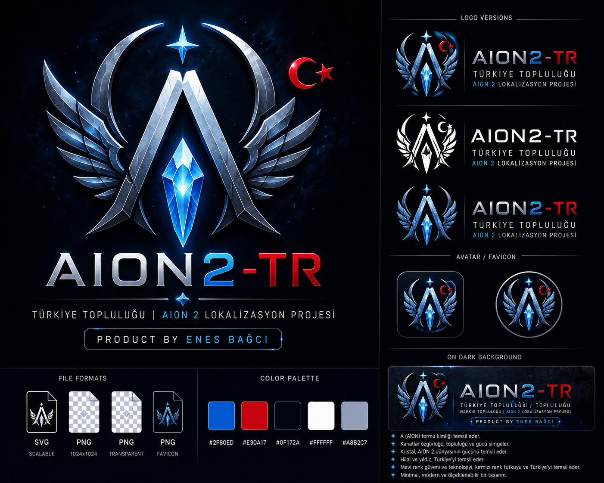

<div align="center">



# AION2-TR

### 🇹🇷 Community-driven Turkish Localization Platform for AION 2

> Modern Launcher • Automatic Updates • Open Source • Community Powered


🚧 **Status:** Under Development

</div>

---

# 📖 About

AION2-TR is an open-source community project that aims to deliver a high-quality Turkish localization experience for **AION 2**.

The project focuses on developing a modern launcher, an automatic update system, a reliable patch engine, and community-driven translation tools before the game's official release.

---

# ✨ Planned Features

- 🇹🇷 High-quality Turkish Localization
- 🎮 Modern Flutter Launcher
- 🔄 Automatic Update System
- 📦 Smart Patch Engine
- 🛠️ File Verification & Repair
- ♻️ Restore Original Game Files
- ⚡ Fast Patch Installation
- 🌍 Open Source Development
- 🤝 Community Contributions
- 📢 News & Announcements
- 📋 Release Notes
- 🌙 Modern Dark UI

---

# 🚧 Current Status

The game has not yet been released.

We are currently preparing the complete project infrastructure, including:

- GitHub Repository
- Project Management
- Documentation
- Launcher Architecture
- Branding
- Translation Infrastructure

---

# 📂 Repository Structure

```text
AION2-TR
│
├── assets/
│   └── branding/
│       └── logo/
│
├── docs/
├── installer/
├── patch/
├── screenshots/
├── tools/
├── translations/
│
├── CHANGELOG.md
├── CODE_OF_CONDUCT.md
├── CONTRIBUTING.md
└── README.md
```

---

# 🗺️ Roadmap

- ✅ Repository Setup
- ✅ Documentation
- ✅ Project Architecture
- ✅ GitHub Project Board
- 🚧 Brand Identity
- 🚧 Project Logo
- ⏳ Flutter Launcher
- ⏳ Patch Engine
- ⏳ Translation System
- ⏳ Auto Updater
- ⏳ Public Beta
- ⏳ Stable Release

---

# 🤝 Contributing

Contributions are always welcome!

You can contribute by:

- Opening an Issue
- Suggesting new features
- Reporting bugs
- Submitting a Pull Request

---

# 📜 License

This project will be released under the **MIT License**.

---

# ❤️ Support the Project

If you like this project, consider giving it a ⭐ on GitHub.

Every star helps the project grow and reach more AION players.

---

# 👨‍💻 Author

**Created and maintained by Mehmet Enes Bağcı**

GitHub: https://github.com/enesbgci81-hub

---

<div align="center">

### AION2-TR

🇹🇷 Built with ❤️ for the Turkish AION Community

</div>